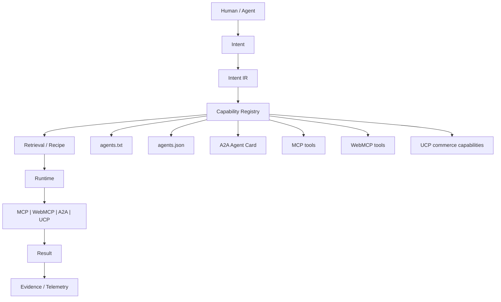

# Protocol adapters

Describe a capability once. Vedaxi can make it available through the interfaces different agents understand.

`Capability` remains the canonical internal contract. Protocol adapters only translate discovery and transport shapes; execution still passes through Elastic retrieval, recipes, runtime, and telemetry.

Current status:

- MCP serving and A2A HTTP+JSON ingress are exercised through gateway integration tests.
- Remote MCP consumption is exercised with a deterministic Streamable HTTP transport test; no live third-party server is claimed.
- WebMCP continues to use the browser-native registration lifecycle and now accepts a projection of the canonical capability contract.
- UCP is projection-only and remains disabled unless an explicitly tagged commerce capability is registered.
- `agents.txt`, `agents.json`, and the A2A Agent Card are generated from registered capabilities and enabled endpoints.

Adding another protocol should require a new `Capability` projection or transport adapter. It should not require changes to Intent IR, retrieval, recipes, or runtime.
